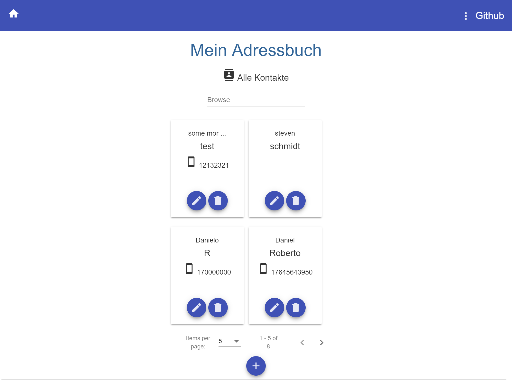

# AdressBook

 

Angular adress book, usable as a progressive web app (PWA) and hosted on github pages.


This project represents a digital adressbook which displays contacts set by the user. The user can add contacts and delete or edit existing ones. A useful search interface makes it easy to find an entry the user is looking for. A method can delete all contacts.


# Install
* Maven and npm are required.
* Run `mvn -v` to ensure that maven is correctly installed and added to the `PATH` variable.
* Run `npm -v` to ensure that node package manager is correctly installed.
* Run `npm install` from the `web`` subdirectory to install the required packages.
* Run `npm i -g npm-check-updates ncu -u npm install` to install package updating tool.
* Run `ncu -g` to update all out of date packages.

# Deploy 
* Run `ng deploy adress-book`.

# Dev

### Frontend
Run `npm run start` for a dev server from subdirectory ``web``.  Navigate to `http://localhost:4200/`. The app will automatically reload if you change any of the source files.

### Backend
Run `mvn clean compile exec:java` (inside the top directory) to run the backend.
On default the backend listens on `http://localhost:8080/`


# Build

### Frontend
Run `ng build` to build the project. The build artifacts will be stored in the `dist/` directory. Use the `-prod` flag for a production build.

### Backend
Run `mvn clean compile package` to build the project. The produced jar file should be located in the /target folder.
Execute the jar to start the backend. (`java -jar JARNAME.jar`)

## Testing
<!-- ## Running unit tests

Run `ng test` to execute the unit tests via [Karma](https://karma-runner.github.io).

## Running end-to-end tests

Run `ng e2e` to execute the end-to-end tests via [Protractor](http://www.protractortest.org/). -->

## Configuration
you can edit the path of the database in the databasemanager (DB_URL).
port and URL of the servlet can be configured in `Servlet` (BASE_URI)

Communication in dev mode is configured via a proxy in
```
adressBook
│   web
|   ├── web\proxy.conf.json
|   ├── web\package.json
```
and package.json is modified.

## Linting
Run ```ng lint <project> --fix``` to fix code style issues.

# Dependencies
A MySQL database is required on the specified path: `jdbc:mysql://localhost/contacts`

A sample database can be found in `db/contacts.sql`
Use "xampp" with phpmyadmin for example under windows for an easy db setup or "mysql-server" on ubuntu.

Maven is required to run the grizzly web framework and other dependencies.


See all package versions in:
```
adressBook
│   README.md
│   package.json  
```

The project uses npm as the packet manager.
 Run `npm -v` to verify the installation.
 Run `npm install` in the current working directory to install all required packages.

 The frontend uses Angular Material and Bootstrap.

 # Architecture
 dependencies are being managed via maven in `pom.xml` under <dependencies>


 angular frontend application and java servlet communicate with the help of a restful webservice.

 ```
 adressBook
 │   web
 |   src
 ```

 ## Backend
 All files can be found inside the `src` folder.
 sources files: `main`, test files: `test`

 ### ContactsResource
 the resource only serves as a communication interface and has no business logic

 ### ContactManager
 the contact manager is responsible for the hashmap including all contacts and updating it when needed (gets updated data from the `DatabaseManager`)


 ### DatabaseManager
 the manager  connects to a mysql database which is required for this programm to run

 ### Servlet
 This class is required to run the grizzly framework.


 ### Contact
 this class has a number of variables which model the typical properties of a adress contact
 these variables are accessible by getter and setter methods.

 ## Angular
 The Angular app consists of multiple components (`AdressEntriesComponent`,`AdressDetailComponent`, `ConfirmDialogComponent`, `DialogComponent` ) and a service `AdressManagementService` which deals with connecting to the database and performs requests.

 A routing module `AppRoutingModule` takes care of navigation between different views, here the detail view of a contact and the all contacts view.

 All imports are managed in the main `AppModule`.
 All files can be found in the `web` folder.
